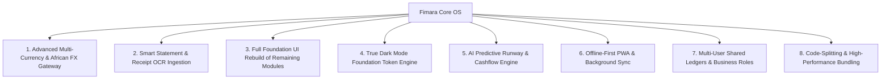

# Fimara (Financial OS) — Master Product Roadmap, Architecture & Next-Gen AI Directive

> **Application Name:** Fimara (Financial OS)  
> **Repository:** `nisaco/Finance_Manager`  
> **Target Audience:** Modern professionals, entrepreneurs, and businesses across Africa and global markets.  
> **Design Philosophy:** African banking grade (Ecobank, MTN MoMo, GCB) — clean, tactile, mathematical, structured, and strictly **not looking AI-generated**.

---

## Part 1: Executive Overview & Architectural Foundation

### 1.1 Technology Stack
- **Frontend:** React 19, Vite 6, TypeScript, Tailwind CSS **v4** (`@tailwindcss/vite`).
- **Backend:** Express 4 + TypeScript, bundled with `esbuild` to `dist/server.cjs`.
- **Database:** MongoDB Atlas with in-memory database fallback.
- **Third-Party Integrations:** Paystack, Google Gemini API (Multimodal + Live WebSocket), Nodemailer, Google OAuth 2.0.
- **Design Tokens:** Defined centrally in `src/design/foundation.css` via `@theme inline` (Zero inline hex codes, zero hardcoded arbitrary pixel font sizes in UI components).
- **Typography:** Satoshi (loaded via Fontshare CDN in `index.html`) with tabular numbers (`.num` class).

---

## Part 2: The Strategic Feature Roadmap for Fimara

Here are the 8 transformative features to elevate Fimara into an elite, bank-grade Financial Operating System:



---

### Feature 1: African Multi-Currency & Real-Time FX Gateway
- **Problem:** Many African professionals and business owners earn in USD/GBP/EUR or trade across borders (e.g. Ghana Cedis GH₵, Nigerian Naira ₦, Kenyan Shillings KSh).
- **Solution:**
  - Multi-currency ledger accounts with real-time conversion rates (Bank of Ghana interbank feed + OpenExchangeRates).
  - Automatically calculate realized & unrealized foreign exchange gains/losses on balances.
  - Multi-currency transaction support with single-click conversion back to base display currency.

---

### Feature 2: Smart Bank & MoMo Statement Ingestion (OCR & Parsing)
- **Problem:** Manual entry of every transaction is tedious and leads to missing records.
- **Solution:**
  - **PDF Statement Importer:** Parse official PDF bank statements (Ecobank, Stanbic, GCB, Access Bank) and Mobile Money SMS/PDF statements (MTN MoMo, Telecel Cash).
  - **Receipt OCR:** Camera capture or image upload of store receipts with automatic parsing of store name, date, itemized amounts, and tax calculation.
  - **Smart Category Matcher:** Heuristic and vector-based category matching that learns from past user categorization.

---

### Feature 3: Complete Foundation UI Rebuild for Remaining Modules
- **Context:** The design foundation (`src/design/foundation.css`) has been unified for the shell, Landing Page, Overview, Transactions, Budgets, and Debts.
- **Pages Remaining for Full Foundation Alignment:**
  1. **`GoalsPage.tsx` (Savings Vaults):** Visual vault metrics, target dates, scheduled automated contributions, compound yield estimations (no progress bars; clear mathematical statement percentages).
  2. **`HistoryPage.tsx` & Shared Components:** Refactor `ReceiptRow` and `TicketStubCard` to eliminate legacy font sizes below 12px.
  3. **`ReportsPage.tsx`:** Clean financial statements (Income Statement, Cash Flow Waterfall, Category Breakdown, Tax Estimation exportable to PDF/CSV).
  4. **`SettingsPage.tsx`:** Security settings, 2FA setup, biometric PIN configuration, audit session logs, webhook & API keys.
  5. **`AIAdvisorPage.tsx`:** Streaming chat UI with Fima AI, financial health diagnostic scorecards, prompt library for investment & debt scenarios.
  6. **`AdminPage.tsx`:** System health, user management, and error log monitoring.
  7. **Modals (13 Modals in `src/components/Modals/`):** Standardize all modals onto `.lg-scrim`, `.lg-sheet`, `.lg-sheet-grip`, with swipe-to-dismiss on mobile.

---

### Feature 4: True Dark Mode Token Engine
- **Current State:** The new foundation tokens in `src/design/foundation.css` are calibrated for crisp light mode.
- **Implementation:**
  - Introduce a comprehensive `.dark` token block inside `foundation.css` that maps:
    - `--lg-canvas`: `#0A0E1A`
    - `--lg-surface`: `#121826`
    - `--lg-sunken`: `#0E1320`
    - `--lg-line`: `#1E293B`
    - `--lg-line-strong`: `#334155`
    - `--lg-ink`: `#F8FAFC`
    - `--lg-ink-2`: `#CBD5E1`
    - `--lg-ink-3`: `#94A3B8`
    - `--lg-ink-4`: `#64748B`
  - Re-link the theme switcher in `useTheme()` to toggle the `.dark` class on the `<html>` root, ensuring high-contrast readability without washed-out dark colors.

---

### Feature 5: AI Predictive Runway & Cashflow Engine (Fima Core)
- **Features:**
  - **Cash-flow Runway Projection:** Linear regression / ARIMA forecast showing projected balance over 30, 60, and 90 days based on recurring bills and historical spending trends.
  - **Anomaly & Price Hike Detection:** Alert users when a subscription increases in price or when an unusual duplicate transaction occurs.
  - **Voice Intelligence:** Low-latency bi-directional voice consultation powered by Gemini Live API over WebSockets.

---

### Feature 6: Offline-First PWA with Background Sync
- **Implementation:**
  - Full client-side caching using IndexedDB via `idb`.
  - Service Worker background sync: If user logs a transaction while offline (e.g. in poor network areas), queue the mutation locally and sync automatically when internet connectivity resumes.
  - Conflict resolution strategy: Server timestamp wins with local optimism.

---

### Feature 7: Multi-User Collaboration & Shared Ledgers (Family & SME)
- **Features:**
  - Create Shared Wallets / Business Accounts.
  - Granular Role-Based Access Control:
    - **Owner:** Full administrative and ledger management access.
    - **Admin:** Can add/edit transactions, manage budgets, and invite members.
    - **Auditor / Accountant:** Read-only access to reports, audit logs, and export tools.
  - Cryptographic audit trail logging every user action with timestamp, IP, and modification diff.

---

### Feature 8: Production Performance & Dynamic Code Splitting
- **Problem:** Main bundle currently ~2.3 MB due to synchronous imports of KaTeX, html2canvas, and all page components.
- **Solution:**
  - Lazy load all routes using `React.lazy()` and `Suspense`.
  - Configure manual chunking in `vite.config.ts` for heavy third-party vendor libraries (`katex`, `html2canvas`, `lucide-react`, `motion`).
  - Target: Initial entry chunk `< 200 KB`.

---

## Part 3: The Golden Design & Coding Rules

1. **Presentation & UX Strictness:**
   - **No Progress Bars:** Never draw a bar to represent a ratio or progress. Write the statement explicitly (e.g., *"GH₵ 6,200.00 of 10,000.00 · 62% funded"*).
   - **No Artificial "AI" Gimmicks:** No rainbow glows, no glassmorphism blur layers behind ordinary text, no 3D card tilt effects, no decorative uninformative graphs.
   - **Hairline Borders:** Use `.lg-card` with `1px solid var(--lg-line)` instead of dropshadows for panels. Elevation is strictly reserved for overlays (drawers, sheets, popovers).
   - **Tabular Figures:** Every amount, percentage, count, and date MUST have the `.num` CSS class to prevent number shifting.
   - **Tap Targets & Safe Areas:** Every touch target must be at least `44px` tall. Drawers and bottom bars must respect `env(safe-area-inset-top)` and `env(safe-area-inset-bottom)`.

2. **Logic & API Integrity:**
   - Maintain full backwards compatibility for API routes in `server.ts` and types in `src/types/`.
   - Preserve all existing props, handlers, form IDs, and accessibility ARIA attributes.
   - If refactoring, maintain functional parity and verify that data flows through Context and state cleanly.

3. **Workflow & Verification Process:**
   - Work on ONE module/page at a time.
   - Ensure clean compilation: verify with `npx tsc --noEmit` and `npm run build` (must exit with code 0).
   - Test responsive layout across 360px (compact phones), 390px (standard iPhone), 834px (tablet), and 1280px+ (desktop).
   - Verify that there is zero horizontal scrollbar overflow (`document.documentElement.scrollWidth <= window.innerWidth`).
   - Verify that zero amounts are formatted neutrally (no positive green `+` or negative red `-` on zero).
   - Never commit `package-lock.json`; this repository strictly tracks `bun.lock`.

---

## Part 4: The Master Prompt (To Give to Any AI Assistant)

*Copy and paste the exact prompt below when instructing any AI assistant to work on Fimara:*

```text
You are an expert Principal Frontend Architect and Financial Systems Engineer continuing development on Fimara (Financial OS), a high-performance React 19 + TypeScript + Vite 6 + Tailwind CSS v4 personal and business finance platform.

Before writing or editing any code, read this entire brief and inspect `docs/UI_REBUILD_HANDOFF.md` and `docs/FIMARA_PRODUCT_ROADMAP_AND_AI_PROMPT.md` in the repository.

### CRITICAL CONSTRAINTS & RULES:
1. STRICT DESIGN PHILOSOPHY (AFRICAN BANKING GRADE):
   - Model the UI on premier African financial institutions (Ecobank, MTN MoMo, Stanbic, GCB).
   - Tone: Professional, mathematical, high-density, tactile, and strictly human-designed. ZERO "AI-like" aesthetics.
   - FORBIDDEN: Progress bars (never draw a progress bar for savings or budgets; print the exact statement figure e.g., "GH₵ 300 left · 75% used"), gradients on content cards, glassmorphism, 3D card tilts, colored glowing drop-shadows, and decorative stock graphics.
   - Hairline borders: Use `1px solid var(--lg-line)` on cards. Reserve elevation shadows (`--lg-e1` to `--lg-e4`) strictly for floating layers (drawers, sheets, modals).
   - Typography: Font is Satoshi with tabular numbers (`.num` class on ALL monetary amounts, percentages, counts, and dates).
   - Zero hardcoded hex values or arbitrary pixel font sizes in UI components. Everything must consume design tokens from `src/design/foundation.css`. Minimum font size is 12px.
   - Tap Targets & Viewport Safe Areas: Minimum 44px tap targets. Mobile drawers and modals MUST include `max(env(safe-area-inset-*))` padding.

2. LOGIC & CONTRACT PRESERVATION:
   - Do not break existing backend endpoints in `server.ts` or contracts in `src/types/`.
   - Preserve all existing props, handlers, form IDs, and accessibility ARIA attributes.
   - If refactoring, maintain functional parity and verify that data flows through Context and state cleanly.

3. WORKFLOW & VERIFICATION PROCESS:
   - Work on ONE module/page at a time.
   - Ensure clean compilation: verify with `npx tsc --noEmit` and `npm run build` (must exit with code 0).
   - Test responsive layout across 360px (compact phones), 390px (standard iPhone), 834px (tablet), and 1280px+ (desktop).
   - Verify that there is zero horizontal scrollbar overflow (`document.documentElement.scrollWidth <= window.innerWidth`).
   - Verify that zero amounts are formatted neutrally (no positive green `+` or negative red `-` on zero).
   - Never commit `package-lock.json`; this repository strictly tracks `bun.lock`.

Proceed with extreme precision, craft, and care.
```
